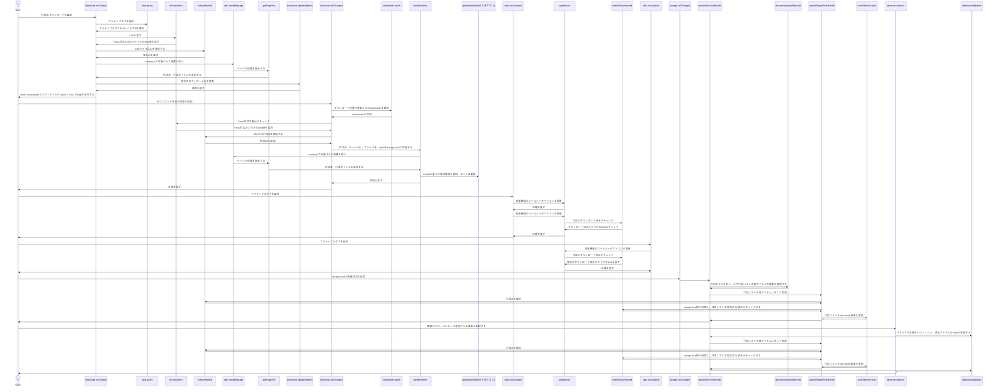
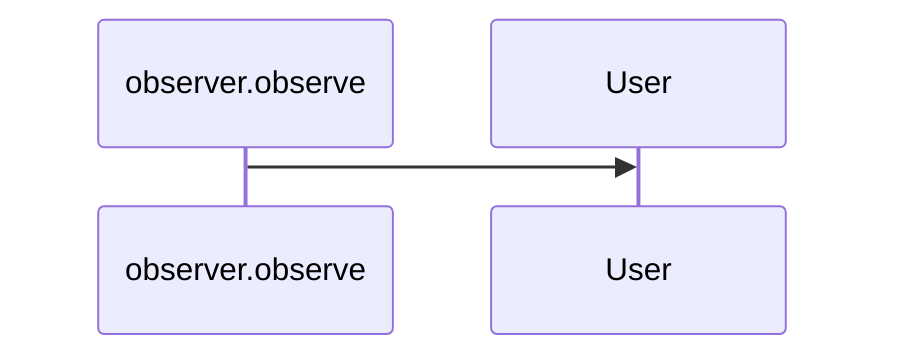

```mermaid
sequenceDiagram
    actor User
    User->>download.onCreated:作品のダウンロードを監視
    download.onCreated->>tabs.query:アクティブタブを取得
    tabs.query->>download.onCreated:アクティブなタブのURLとタブIDを取得
    download.onCreated->>isFanzaWork:URLを渡す
    isFanzaWork->>download.onCreated:Fanza作品のURLかどうかのbool値を返す
    download.onCreated->>extractWorkId:URLから作品IDを抽出する
    extractWorkId->>download.onCreated:作品IDを返却
    download.onCreated->>tabs.sendMessage:content.jsで定義された関数を呼ぶ
    tabs.sendMessage->>getPageInfo:ページの情報を抽出する
    getPageInfo->>download.onCreated:作品名・作品タイトルを返却する
    download.onCreated->>download.updateOptions:作品のダウンロード先を変更
    download.updateOptions->>download.onCreated:処理を戻す
    download.onCreated->>User:down: downloadId とバインドされた tabId と URL のmapを返却する

    User->>download.onChanged:ダウンロード状態の変更を監視
    download.onChanged->>download.search:ダウンロード状態が変更されたdownloadIdを取得
    download.search->>download.onChanged:downloadIdを返却
    download.onChanged->>isFanzaWork:Fanza作品か銅貨をチェック
    isFanzaWork->>download.onChanged:Fanza作品かどうかのbool値を返却
    download.onChanged->>extractWorkId:URLから作品IDを抽出する
    extractWorkId->>download.onChanged:作品IDを返却
    download.onChanged->>saveWorkInfo:作品ID・ページURL・ファイル名・tabIdをstorage.localに保存する
    saveWorkInfo->>tabs.sendMessage:content.jsで定義された関数を呼ぶ
    tabs.sendMessage->>getPageInfo:ページの情報を抽出する
    getPageInfo->>saveWorkInfo:作品名・作品タイトルを返却する
    saveWorkInfo->>updateWorkInfo(まとめてない):workIdに基づき作品情報を追加、もしくは更新
    saveWorkInfo->>download.onChanged:処理を戻す
    download.onChanged->>User:処理を戻す

    User->>tabs.onActivated:アクティブなタブを監視
    tabs.onActivated->>updateIcon:拡張機能のツールバーのアイコンを更新
    updateIcon->>tabs.onActivated:処理を戻す
    tabs.onActivated->>updateIcon:拡張機能のツールバーのアイコンを更新
    updateIcon->>isWorkDownloaded:作品がダウンロード済みかチェック
    isWorkDownloaded->>updateIcon: ダウンロード済みかどうかのboolをチェック
    updateIcon->>tabs.onActivated: 処理を戻す
    tabs.onActivated->>User:

    User->>tabs.onUpdated:アクティブなタブを監視
    tabs.onUpdated->>updateIcon:拡張機能のツールバーのアイコンを更新
    updateIcon->>isWorkDownloaded:作品がダウンロード済みかチェック
    isWorkDownloaded->>updateIcon:作品がダウンロード済みかどうかのboolを返す
    updateIcon->>tabs.onUpdated:処理を戻す
    tabs.onUpdated->>User:

    User->>storage.onChanged:storage.localの更新状況を監視
    storage.onChanged->>updateWorkListBorder:
    updateWorkListBorder->>document.querySelectAll:CSSのクラス名ベースで作品リストの各アイテムの要素を取得する
    document.querySelectAll->>updateWorkListBorder:
    updateWorkListBorder->>updateSingleWorkBorder: 作品リストの各アイテムに対して処理
    updateSingleWorkBorder->>extractWorkId:作品Idを取得
    extractWorkId->>updateSingleWorkBorder:
    updateSingleWorkBorder->>isWorkDownloaded:storage.local内を検索し、注目している作品がDL済みかチェックする
    isWorkDownloaded->>updateSingleWorkBorder:
    updateSingleWorkBorder->>workElement.style:作品リストのleft-border要素を変更
    workElement.style->>updateSingleWorkBorder:
    updateSingleWorkBorder->>updateWorkListBorder:
    updateWorkListBorder->>User:

    User->>observer.observe:無限スクロールによって追加される要素を監視する
    observer.observe->>debouncedUpdate:ブラウザの負荷を小さくしつつ、該当アイテムのstyleを変更する
    debouncedUpdate->>updateWorkListBorder:
    updateWorkListBorder->>updateSingleWorkBorder: 作品リストの各アイテムに対して処理
    updateSingleWorkBorder->>extractWorkId:作品Idを取得
    extractWorkId->>updateSingleWorkBorder:
    updateSingleWorkBorder->>isWorkDownloaded:storage.local内を検索し、注目している作品がDL済みかチェックする
    isWorkDownloaded->>updateSingleWorkBorder:
    updateSingleWorkBorder->>workElement.style:作品リストのleft-border要素を変更
    workElement.style->>updateSingleWorkBorder:
    updateSingleWorkBorder->>updateWorkListBorder:
    updateWorkListBorder->>debouncedUpdate:
    debouncedUpdate->>observer.observe:
    observer.observe->>User:
```

```mermaid
sequenceDiagram
    observer.observe->>User:
```